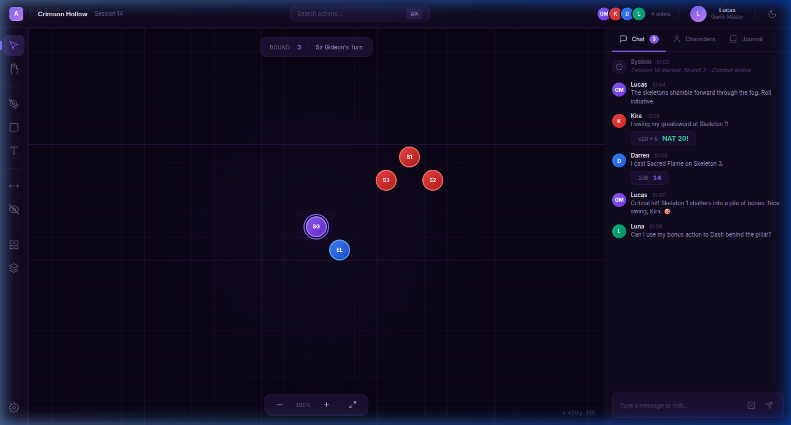
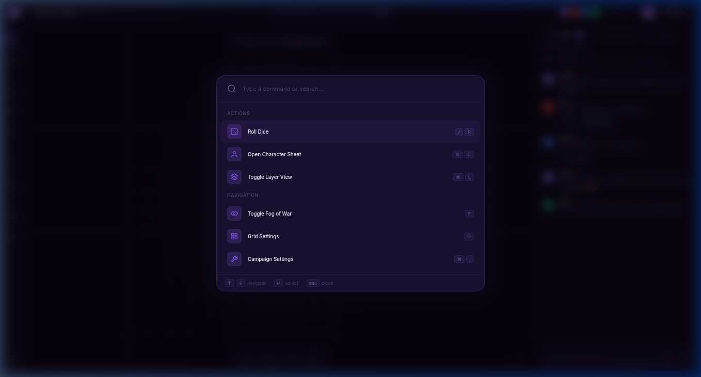
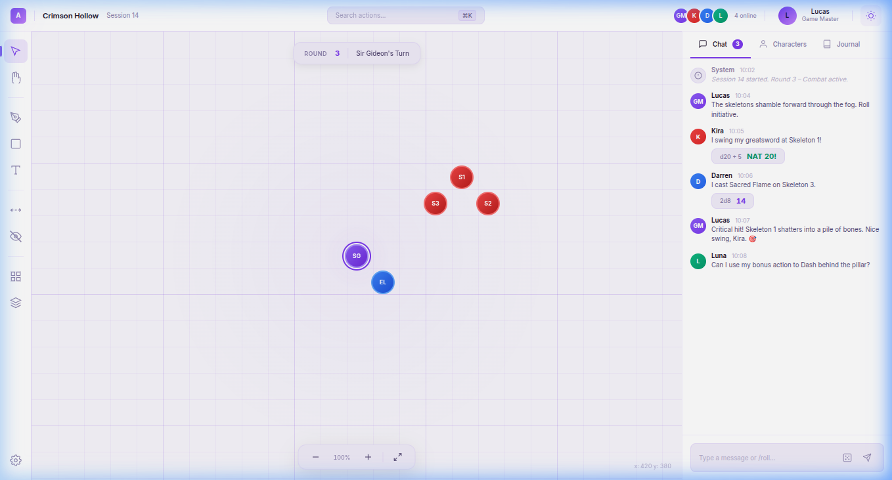
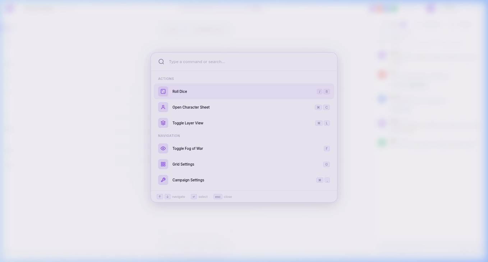
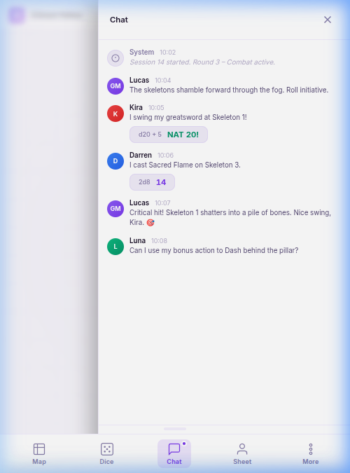
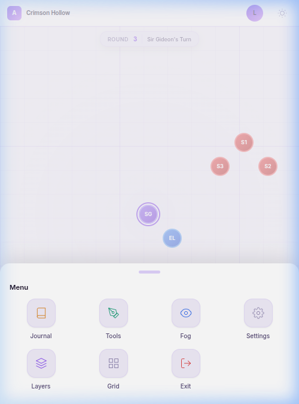
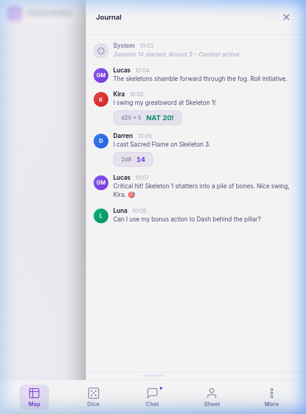
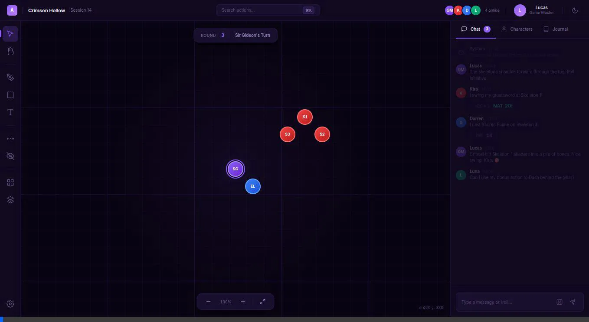

# VTT Wireframe – Walkthrough

Wireframe low-fidelity com estética **Linear.app** — tipografia Inter, ícones SVG monocromáticos, acentos violeta, suporte a **Dark Mode** e **Light Mode** com toggle animado.

## Dark Mode (`#0a0514`)

````carousel

<!-- slide -->

````

## Light Mode (`#f8f6fc`)

````carousel

<!-- slide -->

````

## Mobile Layout (Responsivo)

No mobile (viewport `≤768px`), o layout adota uma abordagem de aplicativos móveis focado em espaço e abas em vez de telas divididas (Padrão de UX: **Opção 1 - Bottom Bar + Menu Mais**).
- O grid do mapa e os menus não dividem a tela. Em vez disso, a navegação principal ocorre via uma **Bottom Navigation Bar** (`[Map]`, `[Dice]`, `[Chat]`, `[Sheet]`, `[More]`).
- As abas redundantes (Chat, Characters, Journal) do Desktop são **ocultadas**.
- Clicar em ações como "Chat" ou selecionar algo no "More" abre a sidebar sobre o mapa como uma gaveta limpa. O título no topo muda dinamicamente de acordo com a aba aberta (ex: `Chat`, `Journal`).
- **Gestos Touch:** Para visualizar os menus extras (Settings, Layers, etc), o usuário pode clicar em `[More]`, ou **deslizar/arrastar o dedo para cima** na Bottom Nav Bar, o que puxará um **Bottom Sheet** estilo Android para a tela. Um deslize para baixo ou toque fora o esconde novamente.

````carousel

<!-- slide -->

<!-- slide -->

````

## Demo



## Componentes

| Componente | Descrição |
|---|---|
| **Header** | Logo, campanha, busca ⌘K, avatares, perfil, **toggle de tema** 🌙/☀️ |
| **Toolbar** | 10 ferramentas com indicador ativo violeta |
| **Canvas** | Grid animado, 5 tokens, round tracker, zoom controls |
| **Sidebar** | Tabs Chat/Characters/Journal, chat com dice rolls |
| **Command Palette** | Overlay blur, busca, ações com atalhos |

## Interatividade

- **Toggle de tema** (ícone 🌙/☀️ no header) com animação de rotação e persistência em `localStorage`
- **⌘K / Ctrl+K** abre Command Palette
- Toolbar e tabs da sidebar são interativos
- **Mobile gestures**: Swipe-up do bottom sheet e backdrop de fechamento

## Link para o Wireframe HTML

Para testar, abra [vtt-wireframe.html](./vtt-wireframe.html) no navegador (ou utilize ferramentas de emulação mobile).
